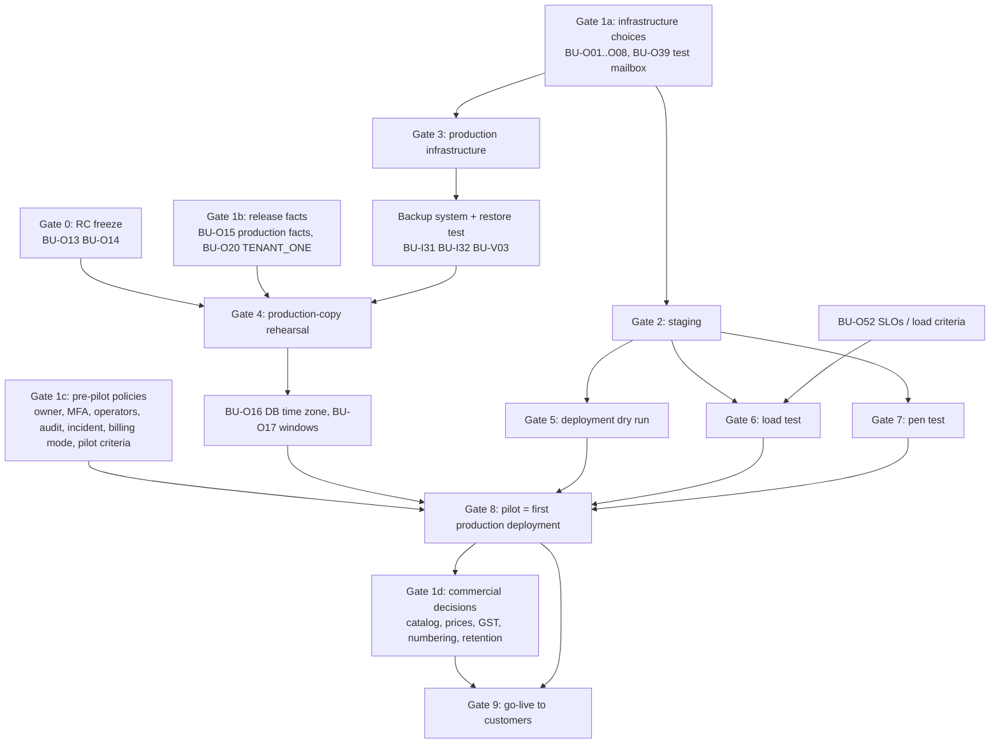

# Production Bring-Up — Stage 1: Release Candidate, Environment and Owner-Decision Intake

**For:** the project owner, the release owner, Infrastructure/DBA, Security and Finance.

**Date:** 2026-10-06. **Prepared from:** the repository at `feature/production-readiness` and its documentation. Nothing was changed in the application; nothing was pushed, merged or deployed.

**Final status: BLOCKED — OWNER DECISION REQUIRED** (§12). Production remains **NO-GO**.

**Labels used throughout:**

| Label | Meaning |
|---|---|
| **VERIFIED** | Checked in this stage against the repository, git or a command output |
| **UNKNOWN** | Cannot be determined from the repository (for example, what production runs) |
| **OWNER DECISION** | A choice only the owner can make; this document never makes it |
| **INFRASTRUCTURE DEPENDENCY** | Needs a system outside the repository |
| **EXTERNAL VALIDATION** | Needs an environment, a party or a test that does not exist yet |
| **BLOCKED — VALUE REQUIRED** | The application needs a value nobody has supplied |

---

# PART 1 — Current baseline

## 1.1 Repository state (VERIFIED, 2026-10-06 ~02:10 UTC)

| # | Item | Value | Evidence |
|---|---|---|---|
| 1 | Current branch | `feature/production-readiness` | `git branch --show-current` |
| 2 | Current HEAD | `f036b775badb5d7b9ce1cd7656e7c3d672eec75f` (`f036b77`, docs: regression results) | `git rev-parse HEAD` |
| 3 | Release-candidate code | **`95f85d5`**, the last code change (`chore: close repository production readiness gaps`) | `git diff --name-only 95f85d5 HEAD -- . ':(exclude)docs'` is empty |
| 3a | Tested commit | **`cf9082c`** (contains `95f85d5`). HEAD differs from it only in `docs/production-readiness-code-closure-final.md` and `docs/production-readiness-final-report.md`, which no test reads | `git diff --name-only cf9082c HEAD` |
| 4 | Code-closure commits | `95f85d5` (code), `cf9082c` (runbooks and closure records), `f036b77` (regression results); discovery `2a5e378` | `git log` |
| 5 | SaaS-7 baseline | `54e551b` (`feature/saas-7-scale-reliability`) | `git log` |
| 6 | Latest application state | SaaS-1…SaaS-7 plus the code closure, on `95f85d5`. 179 migrations (`main` has 75: **104 in the release delta, 25 forward-only**). 227 commits ahead of `main`. Laravel 13.30.1, PHP ^8.5, Filament 5.7.6, Livewire 4.4.2 | `git ls-tree`, `composer.lock` |
| 7 | Working tree clean? | **Yes** — 0 changed or untracked files; 0 stashes | `git status --porcelain`, `git stash list` |
| 8 | Uncommitted changes | None | as above |
| 9a | Pushed? | **No.** The branch has no upstream. The remote holds only `main`, `production` and `test` (all `9cba8e3`), `feature/sep_21_demo`, `feature/sep_22_requistion`; no tags. None of the SaaS, hotfix or readiness commits is on the remote | `git ls-remote --heads --tags origin` (read-only) |
| 9b | Merged? | **No.** HEAD is not in `main`; `main` (`9cba8e3`) is an ancestor of HEAD | `git merge-base --is-ancestor` |
| 9c | Deployed? | **UNKNOWN.** The repository cannot see any running environment. A remote branch named `production` exists at `9cba8e3` (= `main`); whether that is what runs in production is not visible | — |
| 10 | Test baseline | See §1.2 | `docs/production-readiness-code-closure-final.md` §5 |

**Local-only branches of note (VERIFIED):** `feature/saas-1-tenant-foundation` … `feature/saas-7-scale-reliability`; `hotfix/filament-delete-authorization` (`2fab3fd`) and `hotfix/p810-production-authorization` (`599f0c5`, which contains `2fab3fd`); `feature/sep_25_hrm` (`3fb40d6`, the Phase 8.11 line; an ancestor of HEAD; **not touched**).

**Production's possible starting points** (VERIFIED from git; which one production runs is UNKNOWN):

| If production runs | Migrations there | Release delta |
|---|---|---|
| `main` / remote `production` (`9cba8e3`) | 75 | 104 (25 forward-only) |
| the hotfix line (`599f0c5`) | 75 (the hotfixes add no migration) | 104 |
| the Phase 8.11 line (`feature/sep_25_hrm`, `3fb40d6`) | 164 | 15 |
| anything else | UNKNOWN | UNKNOWN |

## 1.2 Test baseline (VERIFIED from the recorded run)

Complete regression on **`cf9082c`**, clean tree, 2026-10-06 00:05–01:06 UTC (outside the 18:30–24:00 UTC window of 10 date-sensitive tests), MySQL 8.4.11 and SQLite in memory:

| Suite | SQLite | MySQL |
|---|---|---|
| Full | 2,793 / 2,793 | 2,792 passed, 1 skipped (SQLite-only trigger test), 0 failed |
| SaaS-1 / 2 / 3 / 4 / 5 / 6 / 7 | 105 / 101 / 86 / 90 / 58 / 109 / 87 — all passing | same; SaaS-7 86 + 1 skipped |
| Architecture / Security | 36 / 454 | 36 / 453 + 1 skipped |
| Concurrency (MySQL) | — | 74 / 74; SaaS-7 races 13 / 13 |
| Mutation | Closure controls 28 / 28 (re-run); SaaS-7 56 / 56 **carried forward from SaaS-7** | |
| Browser | NOT APPLICABLE (no browser suite) | |

Because HEAD differs from `cf9082c` only in two documents that no test reads, this baseline describes the current HEAD. **It is a development-host baseline**: no test has run on a container runtime, a staging environment or a production copy.

## 1.3 Classification of the baseline

| Statement | Label |
|---|---|
| The release-candidate code, its tests and its documentation | VERIFIED |
| What production runs, its migration state, data volumes, configuration, topology | UNKNOWN (D8.9-026) |
| Which line is released, and whether SaaS ships combined with or after Phase 8.11 | OWNER DECISION (PRD-01, D-S1-O1) |
| Hosting, runtime, secrets, network, monitoring, backup, CI | INFRASTRUCTURE DEPENDENCY |
| Production-copy rehearsal, deployment dry run, restore test, load test, pen test, pilot | EXTERNAL VALIDATION |

## 1.4 Corrections to earlier documents found in this stage

These were found while reconciling the registers. They change no code; they are recorded here so that nobody relies on the earlier wording.

| # | Correction | Evidence |
|---|---|---|
| C-1 | **The production-readiness security counts ("High 0") omit SEC-88-02 (High)** — no retention, erasure or anonymisation of candidate personal data. The owner **deferred** it on 2026-10-01 (decision R-14, class C); it stays High and open | `docs/phase-8-8-retention-decision.md:3,9,18,118`; `docs/phase-8-10-backlog-reconciliation.md:182` |
| C-2 | D-S1-O4 is listed as open in `production-readiness-final-report.md` §34 but was decided by D-S3-15 | `docs/saas-1-decision-register.md:48` |
| C-3 | Gate items from earlier phases are missing from the production-readiness decision register and release checklist: P89-OPS-015 / P7-FRZ-1 (confirm the AI key was rotated and the old one revoked), TD-002 (the development seeder's default admin password must never exist in production), D8.9-027 (release line), D8.10-006 (interview time zones), D8.10-014 (AI provider terms) | `docs/saas-7-production-readiness.md:84`; `docs/runbooks/production-environment.md:75-85` |
| C-4 | `APP_TRUSTED_HOSTS` must also contain `localhost`, or the compose healthcheck (`http://localhost/health/ready`) is refused by the trusted-host check. The app then never turns healthy, and the workers and scheduler never start. This is stated only in `.env.example:8`; neither the production checklist nor preflight covers it | `.env.example:8`; `docker-compose.yml:95`; `bootstrap/app.php:66` |
| C-5 | Staging "blockers" from `ops:preflight` are **reported but not enforced**: the entrypoint enforces preflight only when `APP_ENV=production`. Staging must run `ops:preflight` explicitly and gate on its exit code | `docker/entrypoint.sh:48` |
| C-6 | Comment-only inconsistencies (no behaviour): `config/database.php:78-79` names `DB_CACHE_LOCK_CONNECTION=mysql_cache` while preflight and compose require `mysql`; `Dockerfile:4` says PHP ">= 8.4.1" while the image is 8.5.11 | as cited |
| C-7 | The panel performance figures (candidate list, pipeline, dashboard) come from Phase 8.x, **before** the multi-tenant schema. They have not been re-measured under tenancy | `docs/phase-8-9-performance.md`; SaaS-7 measured only the API and indexes |

---

# PART 2 — Authoritative production-gate register

Every unresolved item from the production-readiness and code-closure reports, the SaaS-1…7 registers, and the earlier-phase gate items, reconciled into one list. **Aliases are merged** (the same question under several IDs). Status of every OWNER item: **OPEN** unless stated.

**Blocks:** S = staging, R = production-copy rehearsal, P = pilot (first production deployment), G = go-live to customers. **F** = only before a feature is enabled for anyone.

## A. Owner and business decisions

### A1. Infrastructure choices (owner decides; infrastructure provides)

| ID | Decision | Source IDs | Default today | S | R | P | G |
|---|---|---|---|---|---|---|---|
| BU-O01 | Hosting provider and container runtime/orchestrator for staging and production; whether production runs the compose stack | no ID; D8.9-026 (topology unknown); P810-OP-05 | None. Compose stack in the repository, never executed | ✔ | ✔ | ✔ | ✔ |
| BU-O02 | Secrets manager / environment injection; `APP_KEY` custody and backup | D-S7-O1 ≈ D-S6-O7, P810-OP-14 | Environment variables only | ✔ | ✔ | ✔ | ✔ |
| BU-O03 | Domain names, DNS, TLS termination, proxy/load balancer | D-S7-O3 ≈ D8.10-023 | None | ✔ | | ✔ | ✔ |
| BU-O04 | Network egress model (proxy, NAT, firewall, fixed source IPs) | D-S7-O2 = D-S6-O15 | Application SSRF guard only | ✔ (for webhook tests) | | ✔ | ✔ |
| BU-O05 | Monitoring and error-tracking vendor; log aggregation | D-S7-O6 ≈ D8.9-019 | Log lines and health endpoints only | ✔ | | ✔ | ✔ |
| BU-O06 | Backup tool, frequency, retention, off-host location, key custody; RTO; RPO; DR; restore-test cadence; point-in-time recovery | D-S7-O7 = D8.9-007/008/009a–d/010/028; P89-OPS-001; P810-OP-06 | **No backup system; no values** | ✔ (staging restore test) | ✔ | ✔ | ✔ |
| BU-O07 | CI and deployment strategy (runner, registry, blue/green or drained window) | D-S7-O12 ≈ D8.10-005, D8.9-022/023, P810-OP-09 | No CI; drained maintenance window documented | ✔ | | ✔ | ✔ |
| BU-O08 | Database sizing, replicas, scaling | D-S7-O13 ≈ D8.9-013 | Single MySQL; no tuning in compose | ✔ | ✔ | ✔ | ✔ |
| BU-O09 | Shared cache technology | D-S7-O4 ≈ D8.9-014 | Database store on MySQL (sufficient at measured scale). Redis is not supported by the image without a dependency change | | | | |
| BU-O10 | Worker/queue capacity and memory limits | D-S7-O5 ≈ D8.9-018 | Compose: 4 single-process workers, no memory limit | | | ✔ | ✔ |
| BU-O11 | Container log-driver limits | P810-OP-07 | Not set | | | ✔ | ✔ |
| BU-O12 | WAF in front of the application | none in the repository (SaaS-7 review §9 lists WAF as not visible) | None | | | | ✔ (owner/security) |

### A2. Release

| ID | Decision | Source IDs | Default today | S | R | P | G |
|---|---|---|---|---|---|---|---|
| BU-O13 | **Release line and release commit**; review and merge of the `feature/saas-*` branches into it | PRD-01 = D8.9-027 = D8.10-002/003/021; G-09 | Unknown which line production runs | | ✔ | ✔ | ✔ |
| BU-O14 | **Release order:** Phase 8.11/RMS first and SaaS later, or one combined upgrade | D-S1-O1 = D-S2-O5 | Recommendation on record: RMS first | | ✔ | ✔ | ✔ |
| BU-O15 | **Provide production facts:** migration state, volumes, topology, configuration | D8.9-026 | Unknown | | ✔ | ✔ | ✔ |
| BU-O16 | Database session time zone (decided from the rehearsal) | PRD-04 (PR-02) | Unset: server zone; preflight warns | | (decided here) | ✔ | ✔ |
| BU-O17 | Maintenance window, rollback decision window, post-release watch window | PRD-10 ≈ D8.9-023 | Not set; measured in the rehearsal | | | ✔ | ✔ |
| BU-O18 | Pre-opening smoke tests through a maintenance bypass | PRD-11 | No bypass | | | ✔ | ✔ |
| BU-O19 | Old links after the upgrade (404 or redirect for Tenant #1); onboarding communication | D-S1-O3; D-S2-O2 | 404s; release notes recommended | | | ✔ | ✔ |

### A3. Tenant #1 (the existing organisation, created by the migration)

| ID | Decision | Source IDs | Default today | S | R | P | G |
|---|---|---|---|---|---|---|---|
| BU-O20 | `TENANT_ONE_*` values (slug, name, legal name, time zone, locale, currency, country) | D-S1-O2 = PRD-02 | `main`; `APP_COMPANY_NAME`/`APP_NAME`; Asia/Kolkata; en; INR; IN | | ✔ | ✔ | ✔ |
| BU-O21 | **Tenant #1's owner** (an active member holding CHRO) | PRD-03 | **None**: the migration sets no owner; integrity warns | | | ✔ | ✔ |
| BU-O22 | Tenant-wide MFA for every member from day one | D-S2-O4 | Privileged roles and operators already enforced | | | ✔ | ✔ |
| BU-O23 | When and to which plan Tenant #1 leaves `legacy` | D-S3-O5 | `legacy` (everything, unlimited; no API/webhooks) | | | | ✔ (customers) |
| BU-O24 | Branding, billing contact, support-access policy for Tenant #1 | discovery A27 | As configured | | | ✔ | ✔ |

### A4. Commercial and billing

| ID | Decision | Source IDs | Default today | S | R | P | G |
|---|---|---|---|---|---|---|---|
| BU-O25 | **Billing at launch:** a payment provider, or manual/contract billing, or no billing for the pilot | PRD-06; D-S4-O1 | **Fake adapter only, refused outside `local`/`testing`.** Manual and contract billing work without a provider (VERIFIED in code) | | | ✔ | ✔ |
| BU-O26 | Commercial plan catalog; prices; currencies | D-S3-O1; D-S4-O2; D-S4-O9 | Development defaults; no prices seeded; INR and USD | | | | ✔ |
| BU-O27 | Trial policy (end, grace, read-only, length) and trial billing | D-S3-O3; D-S4-O3 | Access closes, data kept; no payment method | | | | ✔ |
| BU-O28 | Cancellation, plan change, **proration**, refunds, dunning | D-S4-O4/O5/O6 | Period end; **no proration**; 7-day grace; platform-only refunds | | | | ✔ |
| BU-O29 | **GST / tax treatment** | D-S4-O7 | No tax calculated | | | | ✔ (before the first Indian invoice) |
| BU-O30 | **Invoice numbering** | D-S4-O8 | `RE/{FY}/{n}`, year from April | | | | ✔ |
| BU-O31 | Billing contact rules; **billing operators** | D-S4-O10; D-S4-O11 | One active-member contact; platform administrators | | | ✔ (if billing in pilot) | ✔ |
| BU-O32 | Limit semantics: drafts count toward requisition limit; owner takes a seat | D-S3-O2; D-S3-O4 | Yes; yes | | | | ✔ (accept or change) |

### A5. Platform and compliance

| ID | Decision | Source IDs | Default today | S | R | P | G |
|---|---|---|---|---|---|---|---|
| BU-O33 | **Platform operators** named, and who runs `plans:*`/`tenants:*`/`billing:*` | D-S1-O5 = D-S2-O1 = D-S5-O7; D-S3-O6; D-S4-O11 | Roles exist; nobody named | | | ✔ | ✔ |
| BU-O34 | Support access: maximum duration, approval, break-glass | D-S5-O1; D-S5-O2 | 480 min; tenant approves; no break-glass | | | ✔ | ✔ |
| BU-O35 | Ownership transfer policy | D-S5-O3 | Platform admins, reason, active CHRO | | | ✔ | ✔ |
| BU-O36 | **Deletion and purge policy:** grace, authorisation, restoration, orphan identities | D-S5-O4/O9/O11/O13 | 30 days; two operators; no restoration; identities kept | | | | ✔ |
| BU-O37 | **Retention:** logs, data exports, compliance exports, audit, backups, tenant data after cancellation/deletion, candidate personal data and erasure; webhook and idempotency data | R-1…R-13; SEC-88-02 (High, deferred by R-14); D-S7-O9; D-S5-O5/O6; D-S3-O7; X-8; D-S6-O12/O13; D8.9-024/030 | Logs kept forever (`LOG_DAILY_DAYS=0`); exports forever; audit forever; no erasure path | | | ✔ (logs, backups) | ✔ (all; confirm SEC-88-02 deferral for customers) |
| BU-O38 | **Audit immutability:** install `audit:protect` triggers (privileged DB user) or accept application-only | PRD-05 = D-S7-O8 = D-S5-O10 (S7-12, Medium) | Application-only; preflight and integrity warn | | | ✔ | ✔ |
| BU-O39 | **Alert recipient and on-call** | PRD-09 = D-S5-O8 = D-S7-O6 ≈ D8.9-020/025 | None; a production container refuses to start without `PLATFORM_NOTIFY_EMAIL` | ✔ (a test mailbox) | | ✔ | ✔ |
| BU-O40 | **Incident notification policy**; incident severity model | PRD-13; D8.9-021 | None | | | ✔ | ✔ |
| BU-O41 | Previous-`APP_KEY` retention after a compromise | PRD-12 | Not set | | | | ✔ |
| BU-O42 | When to suspend a customer | `runbooks/tenant-suspension.md` | Owner decision, no default | | | | ✔ |
| BU-O43 | AI in production: provider terms, region, training use, preview models; **confirmation that the exposed AI key was rotated** | D8.10-014; P89-OPS-015 = P7-FRZ-1 | AI disabled (keys unset); rotation unconfirmed | | | ✔ (confirmation) | ✔ |
| BU-O44 | Seeded default admin password (`AdminUserSeeder`) never in production | TD-002 | Open; operations hygiene | | ✔ | ✔ | ✔ |
| BU-O45 | Interview time-zone model (self-scheduling, calendar and Zoom sync) | D8.10-006 | Manual scheduling only | | | F | F |

### A6. API and integrations (feature gates: the API and webhooks are off for every tenant; no plan grants them)

| ID | Decision | Source IDs | Default today | F |
|---|---|---|---|---|
| BU-O46 | **API exposure**, authentication model, credential lifecycle, rate limits, versioning, documentation exposure | D-S6-O1/O2/O3/O4/O8/O10 | Reads + applicant intake; member-owned credentials; 90/365 days; 120/600/300 per minute; `/api/v1`; OpenAPI in repository only | ✔ |
| BU-O47 | **API and webhook plans and price** | D-S6-O11 | None; per-tenant platform override only | ✔ |
| BU-O48 | **CORS** origins | PRD-08 (PR-01) | Any origin, no credentials; preflight warns | ✔ |
| BU-O49 | **Webhook policy:** retries, event catalogue, data retention | D-S6-O5/O6/O12 | 7 attempts ≈ 21 h; 4 thin events; 30 days | ✔ |
| BU-O50 | **Webhook failure alerting**; **revocation and replay limits** | PRD-14 (PR-05); PRD-15 (PR-06) | Counts only, no alert; per credential/tenant; replay unlimited, audited | ✔ |
| BU-O51 | Provider accounts per tenant (shared platform accounts today) | D-S1-O6 | Shared accounts and circuit | ✔ (accept or change) |

### A7. Scale, load test and pilot

| ID | Decision | Source IDs | Default today | S | R | P | G |
|---|---|---|---|---|---|---|---|
| BU-O52 | **Supported scale and SLOs:** concurrency target, page SLOs, queue SLOs, load-test pass criteria | D8.9-001…006, D8.9-011, D-S7-O13; capacity plan §6 "owner to set" | **Not defined anywhere** | | | ✔ (Gate 6 precedes the pilot) | ✔ |
| BU-O53 | **Pilot tenant** and its sign-off owner | PRD-07 | None designated | | | ✔ | |
| BU-O54 | **Pilot acceptance criteria and duration** | no ID; discovery A28 says "an agreed period", "after sign-off" | **Not defined** | | | ✔ | |
| BU-O55 | Remaining runbooks: billing webhook failure (after a provider); partial outage runbooks | PRD-16 | Not written | | | | ✔ |
| BU-O56 | Minor defaults to accept or change: invitation lifetime (72 h); public developer access (none); idempotency retention (24 h); per-tenant workload limits | D-S2-O3; D-S6-O9; D-S6-O13; D-S7-O11 | As stated | | | | ✔ (accept) |

## B. Infrastructure

| ID | Requirement | What the application demonstrably needs | Evidence | Status |
|---|---|---|---|---|
| BU-I01 | Production hosting | A host or cluster that runs the image, a MySQL 8.4 database, a persistent shared volume | `docker-compose.yml`; `Dockerfile` | INFRASTRUCTURE DEPENDENCY (BU-O01) |
| BU-I02 | Container runtime | Runs `migrate` (one-shot), `app`, 4 workers, 1 scheduler in the dependency order of §5 | `docker-compose.yml:69-206` | Never executed (A20) |
| BU-I03 | Docker image / build | Multi-stage build: PHP 8.5.11 (digest-pinned), Composer 2.9.5, Node 22.22.1 (`npm ci && npm run build`; fetches `fonts.bunny.net` at build), LibreOffice Writer, gd/intl/zip/pdo_mysql/bcmath/exif/pcntl. A registry and a tagging rule (`APP_IMAGE_TAG` = commit) | `Dockerfile:7-117` | Build never executed; registry undefined |
| BU-I04 | Production deployment | A mechanism that reproduces the drained order of `queue-operations.md` §1 | runbooks | INFRASTRUCTURE DEPENDENCY (BU-O07) |
| BU-I05 | Staging environment | Same image and topology as production; `APP_ENV=staging`; its own database, volume, domain and TLS; a mail sink or real SMTP to test addresses; no customer data unless a sanctioned copy | §4 | Does not exist |
| BU-I06 | Production MySQL | MySQL 8.4 (the only version proven), utf8mb4, strict mode, `GET_LOCK`, InnoDB; sizing (`max_connections`: each PHP process can hold two connections, `mysql` and `mysql_cache`); slow-query and deadlock logs; binary logging if point-in-time recovery is chosen | `config/database.php`; `OpsMigrate.php:30`; load-test research | INFRASTRUCTURE DEPENDENCY (BU-O08) |
| BU-I07 | MySQL UTC configuration | Session time zone decided from the rehearsal (`DB_TIMEZONE` or server default) | PR-02 | Release gate (BU-O16) |
| BU-I08 | Least-privilege database accounts | An application user limited to its database; compose today grants one user ALL | discovery A22 | INFRASTRUCTURE DEPENDENCY |
| BU-I09 | Privileged audit-protection user | A user able to `CREATE TRIGGER` (or `log_bin_trust_function_creators`) to run `audit:protect install` once — only if BU-O38 chooses triggers | `AuditProtection.php`; `AuditProtect.php:14` | Conditional |
| BU-I10 | Shared cache | **No Redis needed.** Database store: data on `mysql_cache`, locks on `mysql`; shared by every container (locks, rate limits, heartbeats, maintenance flag) | preflight `cache_*`; compose | Provided by MySQL |
| BU-I11 | Queue workers | Four processes as compose: `queue` (communications,default; 120 s), `queue-priority` (security,billing,notifications,default; 120 s), `queue-automation` (automation,default; 120 s), `queue-background` (documents,intelligence,integrations,exports,default; 300 s); `--tries=3 --max-time=3600 --force`; SIGTERM delivery; grace 330 s; `retry_after` 330 | `docker-compose.yml:128-206` | INFRASTRUCTURE DEPENDENCY |
| BU-I12 | Scheduler | **Exactly one** `schedule:work`; never also a cron `schedule:run`; 27 tasks, all `onOneServer` + `withoutOverlapping` | `routes/console.php`; compose | INFRASTRUCTURE DEPENDENCY |
| BU-I13 | File storage | A **persistent volume shared** by app, workers and scheduler (`storage/app`), plus `storage/logs`. **Local disk only:** no S3 adapter is installed and private-file links are wired to the `local` disk. Multi-host production needs a shared filesystem. Backed up with the database at the same point in time | `PrivateFileController.php:42`; `composer.lock`; backup runbook §1 | INFRASTRUCTURE DEPENDENCY |
| BU-I14 | Secrets manager | Holds `APP_KEY` (+ previous keys), DB credentials, `QUEUE_HEALTH_TOKEN`, mail and provider secrets; injects them as environment | §4 | INFRASTRUCTURE DEPENDENCY (BU-O02) |
| BU-I15 | Encryption keys | `APP_KEY` (AES-256-CBC) stored apart from backups; a lost key makes encrypted columns unreadable | `app-key-and-secret-rotation.md` | INFRASTRUCTURE DEPENDENCY |
| BU-I16 | Key rotation | Application procedure exists (`security:reencrypt`); the secret-manager procedure does not | runbook | Partial |
| BU-I17 | Network egress controls | Workers need outbound HTTPS to: SMTP; AI providers (if enabled); Twilio, Meta, Google, Microsoft, Zoom (if configured); tenant webhook URLs (if enabled). **No `HTTPS_PROXY` for webhook delivery** (S7-16); LibreOffice isolation | environment research §8 | INFRASTRUCTURE DEPENDENCY (BU-O04) |
| BU-I18 | Domain | The public host in `APP_URL` (staff panel, careers, portal, API and inbound webhooks share it today) | `config/app.php` | BLOCKED — VALUE REQUIRED |
| BU-I19 | DNS | Records for the staging and production hosts | — | INFRASTRUCTURE DEPENDENCY |
| BU-I20 | TLS | Terminated in front of the container (the image serves HTTP on port 80 only). HSTS is emitted when the request is secure | `docker/apache/000-default.conf`; `AddSecurityHeaders` | INFRASTRUCTURE DEPENDENCY |
| BU-I21 | Reverse proxy / load balancer | Forwards `X-Forwarded-*`; its addresses go into `TRUSTED_PROXIES`; `APP_TRUSTED_HOSTS` = public host(s) **plus `localhost`** (C-4) | preflight; `.env.example:8` | INFRASTRUCTURE DEPENDENCY |
| BU-I22 | WAF | Not required by the code; an owner/security choice (BU-O12) | — | OPTIONAL |
| BU-I23 | CI runner | Runs the SQLite, MySQL and concurrency suites (a MySQL 8.4 service), `composer audit`, `npm audit`, the image build; schedules full runs outside 18:30–24:00 UTC (10 date-sensitive tests) | §1.2 | Does not exist (A19) |
| BU-I24 | Deployment pipeline | Build once → tag by commit → push to registry → deploy in the drained order → verify | `queue-operations.md` §1 | Does not exist |
| BU-I25 | Monitoring | External uptime checks of `/health/live`, `/health/ready`, `/health/queue` (bearer `QUEUE_HEALTH_TOKEN`); error tracking; latency from `api.request`; `db.slow_query`; queue age; failed jobs; MySQL metrics; log aggregation | `production-environment.md` | Does not exist (BU-O05) |
| BU-I26 | Error tracking | No SDK is installed; log-based or a vendor's (dependency change if a vendor SDK is chosen) | `composer.lock` | OWNER DECISION |
| BU-I27 | Queue monitoring | `/health/queue` and `queue:health-check` (alerts to `PLATFORM_NOTIFY_EMAIL`); external polling | code | Signals exist; receiver missing |
| BU-I28 | Database monitoring | Connections, lock waits, deadlocks, slow queries, replication if any | — | INFRASTRUCTURE DEPENDENCY |
| BU-I29 | Uptime monitoring | External poller with alert routing | — | INFRASTRUCTURE DEPENDENCY |
| BU-I30 | Alerting and on-call | A monitored `PLATFORM_NOTIFY_EMAIL` mailbox; vendor routing; named on-call (BU-O39) | `PlatformEvents.php:47-57` | Does not exist |
| BU-I31 | Backup | Database (`mysqldump --single-transaction …` per `backup-restore.md` §2) and storage volume, encrypted, off-host, monitored | runbook | **No backup system** (BU-O06) |
| BU-I32 | Restore | Isolated restore environment and procedure `backup-restore-verification.md` | runbook | Procedure only |
| BU-I33 | Disaster recovery | New host + image + secrets + latest backups (`backup-restore.md` §4) | runbook | No DR site; RTO/RPO undecided |
| BU-I34 | Mail transport | **SMTP** (the only transport in the image without a dependency change); SPF/DKIM/DMARC for the sender domain; `MAIL_FROM_ADDRESS` | environment research §7 | BLOCKED — VALUE REQUIRED |
| BU-I35 | Load-test environment | Production-like environment plus an external load generator (capacity plan §6) | §7 | Does not exist |

## C. Validation

| ID | Validation | Method (existing commands and runbooks) | Prerequisites | Status |
|---|---|---|---|---|
| BU-V01 | Production-copy migration rehearsal | Part 6 | BU-O13/O14/O15/O20, BU-I31/I32, an isolated MySQL 8.4 | EXTERNAL VALIDATION — not possible today |
| BU-V02 | Deployment dry run | `queue-operations.md` §1 end to end on staging, including graceful stop | Gate 2 | Not run (no runtime) |
| BU-V03 | Backup/restore test | `backup-restore-verification.md` | BU-I31/I32 | Not run |
| BU-V04 | Load test | Part 7 | Gate 2/3-like environment; BU-O52 | Not run |
| BU-V05 | Penetration test | Part 8 | Staging with TLS and representative data; a tester | Not commissioned |
| BU-V06 | Security configuration validation | `ops:preflight` (production rules) 0 blockers; HSTS and secure cookie over real TLS; trusted hosts/proxies; headers | Gate 3 | Not run |
| BU-V07 | Queue validation | Heartbeats (`queue:drain-status`), drain with `--wait`, SIGTERM finish-in-flight, `retry_after` recovery, paused-tenant resume | Gate 2 | Laravel behaviour verified on the development host (Phase 8.10); never in a container |
| BU-V08 | Scheduler validation | Single `schedule:work`; `schedule:list` = 27; scheduler heartbeat healthy; Queue health "Needs attention" empty | Gate 2 | Never in a container |
| BU-V09 | Tenant isolation validation | `tenancy:verify` on the rehearsal copy and staging; two-tenant probes in the pen test | Gates 4, 7 | Code VERIFIED (suite, races, mutation); environment validation pending |
| BU-V10 | API validation | Only if BU-O46/O47 enable the API: credential issue, `/api/v1/me`, scopes, rate limits, CORS behaviour | Gate 2; decisions | Off by default |
| BU-V11 | Webhook validation | Only if enabled: delivery to a test receiver through real egress, signature, retry, circuit, disable | Gate 2; BU-O04, BU-O49 | Off by default |
| BU-V12 | Billing validation | **Manual/contract path only** (`billing:subscription <slug> subscribe --source=manual|contract`, `billing:payment record …`) — the fake provider is refused outside `local`/`testing`, and no real provider exists | Gate 2; BU-O25 | Code VERIFIED; environment pending |
| BU-V13 | Platform administration validation | Operator grant + MFA; tenant provision, suspend/activate, ownership, support grant approve/use/end, compliance export | Gate 2 | Code VERIFIED; environment pending |
| BU-V14 | Deletion/purge validation | `tenants:deletion` request/approve (two operators) → purge on a staging tenant (grace via `PLATFORM_DELETION_GRACE_DAYS` on staging only) → `tenancy:verify`, `ops:verify-integrity` | Gate 2 | Code VERIFIED; environment pending |
| BU-V15 | File-storage validation | Upload, signed private link, offer letter generation and PDF conversion (LibreOffice on `queue-background`), `storage:audit` | Gate 2 | Never in a container |
| BU-V16 | Cache validation | Maintenance flag across containers, locks across workers, heartbeats, rate limits shared | Gate 2 | Architecture VERIFIED; environment pending |
| BU-V17 | Monitoring and alert validation | Stop one worker on staging → `queue:health-check` (every 5 min) raises a **critical** `worker-silent` event mailed at once to `PLATFORM_NOTIFY_EMAIL`; external monitor sees `/health/*` degrade | Gate 2; BU-O39, BU-I25 | Not run |
| BU-V18 | Mail validation | A real message through the SMTP relay; SPF/DKIM pass | Gate 2 | Not run |
| BU-V19 | Seeded-admin absence | Confirm no `AdminUserSeeder` account or default password exists in production (TD-002) | Gate 3 | Not run |
| BU-V20 | AI key rotation confirmation | Confirm rotation and revocation at the provider (P89-OPS-015) before any AI key is configured | Owner | Not confirmed |

## D. Application

| Item | Status | Evidence |
|---|---|---|
| Code-closure items PRC-01, 02 (#13, #14, #20), 03, 05, 07, 10, 11, 14, 15 | **CLOSED** | `production-readiness-code-closure.md` |
| PR-03 (hotfix lineage) | **CLOSED** with evidence | security review |
| PR-01 (CORS), PR-02 (DB time zone) | Mitigated in code; decision/release gate (BU-O48, BU-O16) | security review |
| PRC-04 (partial outage runbooks), PRC-16 / S7-15 (forgot-password timing) | DEFERRED (not blockers) | code closure |
| S7-12 (audit triggers), S7-13 (export retention), S7-16 (egress), S7-14, S7-25, PR-04…06 | Open; owner/infrastructure dependencies (BU-O38, BU-O37, BU-O04, Part 8) | security review |
| SEC-88-02 (retention/erasure, **High**) | Deferred by the owner (R-14); becomes code work after a retention decision (BU-O37) | C-1 |

**APPLICATION BLOCKER — REQUIRES CODE CHANGE: none found** for the configuration the repository supports (local shared disk, database cache and queue, SMTP, manual/contract billing or none, AI off, API/webhooks off). The following become code work **only if** the owner chooses them; each is recorded so that a choice does not arrive as a surprise:

| Owner choice | Consequence | Evidence |
|---|---|---|
| Online payments (BU-O25 → a provider) | A provider adapter, its webhook verification, tests, and the billing-webhook runbook | `BillingProviderManager.php:18-20,42-46` |
| Object storage (S3 or similar) for files | Dependency (`league/flysystem-aws-s3-v3`) and code: private links and several `->path()` calls assume the local disk | `PrivateFileController.php:42`; environment research §6 |
| Redis for cache or queue | PHP extension or client in the image; configuration and re-validation of locks and heartbeats | `Dockerfile`; D-S7-O4 |
| A mail API transport (SES/Postmark/Resend) instead of SMTP | Dependency change (SMTP to the same vendors works without one) | `composer.lock` |
| A vendor error-tracking SDK | Dependency change | `composer.lock` |
| Retention/erasure (SEC-88-02) | Retention, erasure and anonymisation features | C-1 |

---

# PART 3 — Dependencies and order

## 3.1 Per-gate dependencies

| Item(s) | Prerequisite | Owner | Required input | Evidence required | Validation method | Next dependent | S | R | P | G |
|---|---|---|---|---|---|---|---|---|---|---|
| BU-O01–O08 (infrastructure choices) | — | Project owner + infrastructure lead | Vendor and topology choices | A signed decision record per item | Review against the environment contract (§4) | BU-I01–I35 | ✔ | ✔ | ✔ | ✔ |
| BU-I01–I05, I10–I14, I17–I21, I23, I24, I34 (staging build-out) | BU-O01–O08 | Infrastructure | §4 staging column | Environment inventory; `ops:preflight` output (staging rules) | §4 checks; BU-V02/V07/V08/V15–V18 | Gate 5, Gate 6, Gate 7 | ✔ | | ✔ | ✔ |
| BU-O13, O14, O15, O20 (release line, order, production facts, Tenant #1 values) | — | Project owner + release owner | Line and commit; production `migrate:status`, row counts, configuration; `TENANT_ONE_*` | Decision record; production facts sheet | Matches a §1.1 starting point | BU-V01 | | ✔ | ✔ | ✔ |
| BU-O06 + BU-I31/I32 (backup and restore) | BU-O01, BU-O02 | Infrastructure + DBA | Tool, location, key custody, RPO/RTO | A verified backup and a recorded restore | `backup-restore-verification.md` | BU-V01, Gate 8 | ✔ | ✔ | ✔ | ✔ |
| BU-V01 (rehearsal) | BU-O13/O14/O15/O20, BU-I31/I32, isolated MySQL | Release owner + DBA | Production backup | Part 6 record | Part 6 checks | BU-O16, BU-O17, Gate 8 | | ✔ | ✔ | ✔ |
| BU-O16, BU-O17 (time zone, windows) | BU-V01 | Owner + DBA | Rehearsal measurements | Decision record citing the rehearsal | — | Gate 8 | | | ✔ | ✔ |
| BU-V02 (dry run) | Staging (Gate 2) | Release owner + infrastructure | The image; staging secrets | Timed run log | `queue-operations.md` §1 incl. graceful stop and rollback by tag | Gate 8 | | | ✔ | ✔ |
| BU-O52 (SLOs, load criteria) | — | Owner | Targets | Decision record | — | BU-V04 | | | ✔ | ✔ |
| BU-V04 (load test) | Gate 2/3-like env, BU-O52, BU-I35 | Release owner + infrastructure | Data set; generator | Metrics report vs criteria | Part 7 | Gate 8 | | | ✔ | ✔ |
| BU-V05 (pen test) | Staging with TLS (BU-I18–I21), test tenants/accounts, tester contract | Security + owner | Scope (Part 8); rules of engagement | Tester report; fixes; retest | Part 8 | Gate 8 | | | ✔ | ✔ |
| BU-I06–I09, I13–I21, I25–I31, I34 (production build-out) | BU-O01–O08, BU-O38 (privileged user), BU-O39 | Infrastructure | §4 production column | Inventory; preflight 0 blockers | BU-V06, BU-V17, BU-V19 | Gate 8 | | | ✔ | ✔ |
| BU-O21, O22, O24, O33–O35, O38–O40, O43, O44 (operational policies before first production use) | — | Owner | Names, policies | Decision records | Checklist ticks | Gate 8 | | | ✔ | ✔ |
| BU-O25, O31 (billing for the pilot) | — | Owner + Finance | Mode (manual/contract/none) | Decision record | BU-V12 | Gate 8 | | | ✔ | ✔ |
| BU-O53, O54 (pilot tenant, acceptance) | — | Owner | Tenant, sign-off owner, criteria, duration | Decision record | Part 9 | Gate 8 | | | ✔ | |
| BU-O26–O30, O32, O36, O37, O41, O42 (commercial and lifecycle policies) | BU-O25 | Owner + Finance + Legal | Catalog, prices, GST, numbering, retention | Decision records | BU-V12, BU-V14 | Gate 9 | | | | ✔ |
| BU-O46–O51 (API/webhooks) | BU-O04 (egress) for webhooks | Owner | Exposure, plans, policies | Decision records | BU-V10, BU-V11 | Enabling the feature (any gate) | | | F | F |

## 3.2 Order of completion

**Critical path, in order:**
1. **Infrastructure choices** (BU-O01–O08). Nothing infrastructural can start without them.
2. **Staging** build-out (Gate 2) — in parallel: **release facts and RC freeze** (BU-O13/O14/O15/O20, Gate 0).
3. **Production infrastructure** with the **backup system** (Gate 3); a verified restore (BU-V03).
4. **Production-copy rehearsal** (Gate 4) → decide the database time zone and the windows.
5. In parallel once staging exists: **dry run** (Gate 5), **load test** (Gate 6, after BU-O52), **pen test** (Gate 7).
6. **Pre-pilot policies** (Gate 1c) — can be decided any time before step 7.
7. **Pilot** (Gate 8): the first production deployment.
8. **Commercial decisions** (Gate 1d), then **go-live to customers** (Gate 9).

**Note on the sequence.** The earlier final report (§37) treated the load test and pen test as GA gates and allowed a conditional pilot before them. This plan follows the Stage 1 sequence, which puts both before the pilot. Reversing that order would be the owner's choice.

---

# PART 4 — Environment contract

Only what the application demonstrably requires. **No value is assumed.** Columns: **Dev** (a developer machine), **Staging**, **Production**.

**Class:** REQUIRED · OPTIONAL · OWNER DECISION · INFRASTRUCTURE PROVIDED. A required value that nobody has supplied is marked **BLOCKED — VALUE REQUIRED**.

## 4.1 Runtime and topology

| Item | Dev | Staging | Production | Class / evidence |
|---|---|---|---|---|
| PHP | ^8.5 (64-bit) | 8.5.11 (the image) | 8.5.11 (the image) | REQUIRED — `composer.json:9`; `Dockerfile:7-8` |
| PHP extensions | gd, intl, zip, pdo_mysql, bcmath, exif, pcntl (+ mbstring, opcache, pdo_sqlite) | in the image | in the image | REQUIRED — `Dockerfile:31-39,87-95` |
| Laravel / Filament / Livewire | 13.30.1 / 5.7.6 / 4.4.2 | same (locked) | same (locked) | REQUIRED — `composer.lock` |
| Node (build only) | ≥ 20.19 or ≥ 22.12 | image build uses 22.22.1 | same | REQUIRED for the build — `Dockerfile:10` |
| MySQL | SQLite allowed (warning) or MySQL 8.4 | **MySQL 8.4** | **MySQL 8.4** | REQUIRED in staging/production — preflight `database_driver` (blocker); proven on 8.4.11 only |
| Redis / cache | not needed | not needed (database store) | not needed (database store) | REQUIRED: a shared cache — the database store meets it. Redis: OWNER DECISION, needs an image change |
| Queue | `database` (`sync` warns) | `database`, 4 workers | `database`, 4 workers | REQUIRED — preflight `queue_async`; compose |
| Scheduler | optional | **one** `schedule:work` | **one** `schedule:work` | REQUIRED — never a cron `schedule:run` |
| Filesystem | local disk | persistent volume for `storage/app` and `storage/logs`, shared by all app-image containers | same, backed up with the database | REQUIRED; object storage **not supported** |
| LibreOffice | for offer-letter PDF only | in the image (`queue-background`) | in the image | REQUIRED for offer-letter conversion |
| TLS | not required | **REQUIRED** (preflight `app_url`, `session_secure` are blockers in staging) | **REQUIRED** | INFRASTRUCTURE PROVIDED; terminated in front of the container |
| Domain | localhost | **BLOCKED — VALUE REQUIRED** | **BLOCKED — VALUE REQUIRED** | OWNER DECISION (BU-O03) |
| Workers' outbound HTTPS | as configured | SMTP + enabled providers + test webhook receivers | SMTP + enabled providers + tenant webhook URLs | INFRASTRUCTURE PROVIDED (BU-O04) |
| Monitoring | none | external checks of `/health/*` + alert mailbox (to validate) | external monitoring, alerting, on-call | INFRASTRUCTURE PROVIDED (BU-O05, BU-O39) |

## 4.2 Environment variables

Values below are those the code or compose fixes, or a requirement the code enforces. **Secrets are never written down here.**

| Variable | Dev | Staging | Production | Class / evidence |
|---|---|---|---|---|
| `APP_ENV` | `local` (fake billing and strict authorization need `local` or `testing`) | `staging` | `production` | REQUIRED — tier of preflight |
| `APP_DEBUG` | true allowed | `false` | `false` | REQUIRED — `app_debug` blocker |
| `APP_KEY` | generated | its own key | **BLOCKED — VALUE REQUIRED** (secret source) | REQUIRED — `app_key` blocker |
| `APP_PREVIOUS_KEYS` | — | — | only during a rotation | OPTIONAL — `previous_keys` advice |
| `APP_URL` | `http://localhost…` | **BLOCKED — VALUE REQUIRED** (`https://`) | **BLOCKED — VALUE REQUIRED** (`https://`) | REQUIRED — `app_url` blocker |
| `APP_TRUSTED_HOSTS` | — | staging host(s) **+ `localhost`** | **BLOCKED — VALUE REQUIRED**: public host(s) **+ `localhost`** (C-4) | REQUIRED in practice — `trusted_hosts_app_url` blocker; compose healthcheck |
| `TRUSTED_PROXIES` | — | proxy addresses | **BLOCKED — VALUE REQUIRED** | REQUIRED behind a proxy — advice |
| `APP_COMPANY_NAME`, `APP_NAME` | any | any | **OWNER DECISION** (also feeds Tenant #1's default name) | REQUIRED |
| `APP_IMAGE_TAG` | `local` | the commit | the commit | REQUIRED — rollback by tag |
| `SESSION_SECURE_COOKIE` | — | `true` | `true` | REQUIRED — `session_secure` blocker; **absent from `.env.example`** |
| `DB_CONNECTION` / `DB_HOST` / `DB_PORT` / `DB_DATABASE` / `DB_USERNAME` | sqlite or mysql | `mysql` + infrastructure values | `mysql` + **BLOCKED — VALUE REQUIRED** | REQUIRED — `database_driver` |
| `DB_PASSWORD` | any | a secret | **BLOCKED — VALUE REQUIRED** (not `''`, `secret`, `password`, `root`; compose defaults to `secret`) | REQUIRED — `db_password` blocker |
| `DB_TIMEZONE` | unset | as production will be | **OWNER DECISION after the rehearsal** (BU-O16) | OPTIONAL in code; release gate |
| `CACHE_STORE` / `DB_CACHE_CONNECTION` / `DB_CACHE_LOCK_CONNECTION` | `database` | `database` / `mysql_cache` / `mysql` | same | REQUIRED — `cache_*` blockers; compose sets the two connections |
| `APP_MAINTENANCE_DRIVER` / `APP_MAINTENANCE_STORE` | `file` | `cache` / `database` | `cache` / `database` | REQUIRED for a multi-container release — compose |
| `QUEUE_CONNECTION` / `DB_QUEUE_RETRY_AFTER` / `QUEUE_EXPECT_PROCESSES` | `database` / 330 / false | `database` / 330 / `true` | same | REQUIRED — compose |
| `QUEUE_HEALTH_TOKEN` | — | a secret | **BLOCKED — VALUE REQUIRED** | REQUIRED for monitoring — advice |
| `QUEUE_FAILED_RETENTION_HOURS` | 720 | 720 | OWNER DECISION (retention) | OPTIONAL |
| `FILESYSTEM_DISK` | `local` | `local` | `local` | REQUIRED — `filesystem_private` blocker for `public` |
| `MAIL_MAILER` + `MAIL_HOST`/`PORT`/`USERNAME`/`PASSWORD`/`SCHEME` | `log` | `smtp` to a sink or test addresses | `smtp` — **BLOCKED — VALUE REQUIRED** | REQUIRED — `mail_transport` blocker (production) |
| `MAIL_FROM_ADDRESS` / `MAIL_FROM_NAME` | any | test sender | **BLOCKED — VALUE REQUIRED** (default `hello@example.com` is not checked) | REQUIRED — communications refuse an empty sender |
| `PLATFORM_NOTIFY_EMAIL` | — | a test mailbox | **BLOCKED — VALUE REQUIRED** (BU-O39) | REQUIRED — `platform_alerts` blocker (production) |
| `LOG_STACK` / `LOG_LEVEL` / `LOG_DAILY_DAYS` | any | `daily` / `info` / any | `daily` / `info` / **OWNER DECISION** (BU-O37) | REQUIRED; retention advice |
| `IDENTITY_MFA_ENFORCE` | may be false | `true` (default) | `true` (default) — **not checked by preflight** | REQUIRED to stay on |
| `TENANT_ONE_*` (7 keys) | defaults | as production | **OWNER DECISION** (BU-O20), set before the migration | REQUIRED for the migration |
| `BILLING_PROVIDER` | `fake` (local only) | no usable provider | no usable provider → manual/contract billing only | OWNER DECISION (BU-O25) |
| `BILLING_INVOICE_PREFIX` / `BILLING_INVOICE_YEAR_STARTS_MONTH` / `BILLING_GRACE_DAYS` | defaults | defaults | **OWNER DECISION** (BU-O28, BU-O30) | OPTIONAL (defaults exist) |
| `PLATFORM_DELETION_GRACE_DAYS` / `PLATFORM_DELETION_SECOND_OPERATOR` / `PLATFORM_SUPPORT_MAX_MINUTES` / `PLATFORM_COMPLIANCE_EXPORT_RETENTION_DAYS` | defaults | defaults (grace may be shortened for BU-V14) | **OWNER DECISION** (BU-O34, BU-O36, BU-O37) | OPTIONAL (defaults exist) |
| `CORS_ALLOWED_ORIGINS` | unset | as decided | **OWNER DECISION** (BU-O48) | OPTIONAL — advice |
| `API_RATE_*`, `WEBHOOK_TENANT_*_PER_MINUTE` | defaults | defaults | **OWNER DECISION** (BU-O46, BU-O56) | OPTIONAL (defaults exist) |
| `AI_PROVIDER`, `GEMINI_API_KEY` / `OPENAI_API_KEY`, `AI_PRIVACY_EGRESS_MODE` | optional | unset unless AI is tested | **unset** (AI disabled) until BU-O43 | OPTIONAL — the app degrades to a "not configured" provider |
| `TWILIO_*`, `WHATSAPP_CLOUD_*`, `GOOGLE_CALENDAR_*`, `MICROSOFT_GRAPH_*`, `ZOOM_*` | optional | optional | OPTIONAL per feature (BU-O45, BU-O51) | Each provider reports "not configured" without them |
| `LIBREOFFICE_BINARY` / `LIBREOFFICE_TIMEOUT` | `soffice` / 120 | same | same | REQUIRED (defaults fit the image) |
| `PREFLIGHT_ENFORCE` | — | — | unset (`true`); `false` only as a recorded emergency override | REQUIRED |
| `FIX_STORAGE_OWNERSHIP` | — | after a restore | after a restore | OPTIONAL |

**Not usable in the image as built** (each would be a dependency change): Redis, Memcached, DynamoDB, SQS, Beanstalkd drivers; S3 disk; Postmark/Resend/SES mail transports.

## 4.3 Encryption, API, webhooks, workers, cron, monitoring

| Item | Requirement | Class |
|---|---|---|
| Encryption | `APP_KEY` encrypts: integration secrets, calendar tokens, idempotency responses, inbound payloads, MFA secrets and recovery codes, encrypted queue payloads, cookies, signed links | REQUIRED; custody INFRASTRUCTURE PROVIDED |
| API | Off for every tenant until BU-O46/O47; per-tenant override `tenants:entitlement <slug> api.access on --reason=` | OWNER DECISION |
| Webhooks | Off until BU-O49/O50 and egress (BU-O04) | OWNER DECISION |
| Workers | 4 processes (§B BU-I11); SIGTERM delivered; grace ≥ 330 s | REQUIRED |
| Cron / scheduler | One `schedule:work`; its heartbeat is the scheduler healthcheck | REQUIRED |
| Monitoring | `/health/live` (process), `/health/ready` (database, cache, storage), `/health/queue` (bearer token); `queue:health-check` mails critical events | REQUIRED (receiver INFRASTRUCTURE PROVIDED) |

---

# PART 5 — Production deployment contract

From `docs/runbooks/queue-operations.md` §1, `docker-compose.yml` and `docker/entrypoint.sh`. **"EXISTS"** = a command in the repository or the framework, verified with `php artisan list` / `route:list`. **"COMPOSE"** = valid only if production runs this compose stack; otherwise the equivalent is **INFRASTRUCTURE — TO BE DEFINED**.

## 5.1 PRE-DEPLOY

| Step | Command / action | Source |
|---|---|---|
| Record the running state | Running `APP_IMAGE_TAG`; `php artisan migrate:status` (EXISTS) | §1 step 1 |
| Verified backup available (before the window) | `backup-restore.md` §2 tools (`mysqldump`, `tar`, `gpg`, `sha256sum`) — **INFRASTRUCTURE — TO BE DEFINED** as a real backup system | runbook |
| Maintenance decision | `php artisan down --retry=60` (EXISTS); optional bypass `--secret=…` (BU-O18) | §1 step 2 |
| Stop scheduler | `docker compose stop scheduler` (COMPOSE) | §1 step 3 |
| Drain | `php artisan queue:drain-status --wait=1800` (EXISTS) — 0 ready, 0 reserved, no overlap lock | §1 step 4 |
| Stop workers | `docker compose stop queue queue-priority queue-automation queue-background` (COMPOSE) | §1 step 5 |
| Verify stopped | `docker compose ps --status running --services`; `queue:drain-status` exits 0 | §1 step 6 |
| **Backup now** (the rollback point) | as above, then verify (`backup-restore-verification.md` §1). **Without a verified backup, do not migrate** | §1 step 7 |
| Artifact verification | Image built once from the frozen commit, tag = commit, pulled by digest — **INFRASTRUCTURE — TO BE DEFINED** (registry) | BU-I03 |
| Secrets verification | `php artisan ops:preflight --json` inside the new image with the production environment (EXISTS): `rules: production`, 0 blockers, warnings accepted by name | preflight |
| Database / cache / storage connectivity | `GET /health/ready` of the new image (EXISTS: database, cache and storage probe) | `HealthController` |
| Queue connectivity | `php artisan queue:drain-status` (EXISTS) | — |
| Scheduler readiness | `php artisan schedule:list` = 27 tasks (EXISTS) | — |

## 5.2 DEPLOY

| Step | Command / action | Source |
|---|---|---|
| Start the new release | `APP_IMAGE_TAG=<new> docker compose up -d` (COMPOSE) | §1 step 8 |
| Migration | The `migrate` service runs `php artisan ops:migrate --no-interaction` (EXISTS; MySQL named lock per database) | compose:69-75 |
| Cache/config handling | The entrypoint runs `config:cache`, `route:cache`, `view:cache`, `event:cache`, then `ops:preflight` (production). **Never `optimize:clear` / `cache:clear`** on a live system | `entrypoint.sh:39-53` |
| App | Starts after `migrate` succeeded; healthy when `/health/ready` = 200; stays in maintenance (shared flag) | compose |
| Workers | Start once the app is healthy; healthy on `ops:heartbeat worker --queues=…` (EXISTS) | compose |
| Scheduler | Starts once every worker reports a heartbeat; healthy on `ops:heartbeat scheduler` (EXISTS) | compose |
| Health verification | `docker compose ps` all healthy; `GET /health/ready`, `GET /up` = 200; `php artisan queue:health-check` exits 0 (EXISTS); `GET /health/queue` = 200 | §1 step 10 |
| First SaaS release only | `php artisan tenants:owner <slug> <email> --operator=<admin> --reason=…` (EXISTS); `php artisan audit:protect install` with the privileged user if BU-O38 chooses it (EXISTS) | release checklist step 10 |
| Reopen | `php artisan up` (EXISTS) | §1 step 10 |

## 5.3 POST-DEPLOY

| Step | Command / action | Exists? |
|---|---|---|
| Integrity | `php artisan ops:verify-integrity` → "Integrity OK"; read "(look at)" lines | EXISTS |
| Tenancy | `php artisan tenancy:verify` → 0 violations | EXISTS |
| Audit protection | `php artisan audit:protect status` as decided | EXISTS |
| Smoke tests | Manual list in `production-release-checklist.md` POST-RELEASE 2 | Procedure exists; **automation TO BE DEFINED** |
| Queue test | Heartbeats via `queue:drain-status`; a functional message (for example a password reset to a tester) arrives; no new failed jobs | Partial — **a synthetic queue probe command does not exist (TO BE DEFINED, would be code)** |
| Scheduler test | Scheduler container healthy (`ops:heartbeat scheduler`); `schedule:list` = 27; Queue health page shows nothing under "Needs attention" after one 5-minute cycle | EXISTS |
| Tenant isolation test | `tenancy:verify`; cross-tenant probes belong to BU-V09/pen test | EXISTS (verifier) |
| API test | Only if enabled: a pilot credential calls `GET /api/v1/me` | EXISTS (route); off by default |
| Webhook test | Only if enabled: a delivery to a test receiver in **Webhook Deliveries** | EXISTS; off by default |
| Monitoring verification | External monitor sees `/health/*` green; the alert mailbox receives events | **INFRASTRUCTURE — TO BE DEFINED** |
| Rollback decision | Within BU-O17's window: release without migrations → previous tag; with migrations → restore the pre-release backup, then previous tag (`failed-deployment.md`, `failed-migration.md`). **`migrate:rollback` is never the rollback** | Procedure exists |

---

# PART 6 — Production-copy migration rehearsal (plan and readiness check)

**Nothing here may touch production.** Production is only ever read through a backup.

## 6.1 Inputs

| Input | Status |
|---|---|
| Source: a production backup (database + storage volume, same point in time) | **BLOCKED** — no backup system (BU-O06, BU-I31) |
| Production facts: `migrate:status`, row counts per table, table sizes, MySQL version and configuration | **BLOCKED** — UNKNOWN (BU-O15 / D8.9-026) |
| Release line and commit to rehearse (and whether Phase 8.11 ships first) | **BLOCKED** — OWNER DECISION (BU-O13, BU-O14) |
| `TENANT_ONE_*` values (read by the backfill migration) | **BLOCKED** — OWNER DECISION (BU-O20) |
| Target: an isolated MySQL 8.4 with production's configuration (buffer pool, binlog, time zone), no network path to production, no outbound mail or webhooks | **BLOCKED** — INFRASTRUCTURE DEPENDENCY |
| Production `APP_KEY` (and previous keys), to read encrypted values | **BLOCKED** — secrets source (BU-O02) |
| The release image | Buildable from the frozen commit; never built (BU-I03) |

**Readiness today: NOT READY.** Every input above is missing.

## 6.2 Procedure

Extends `docs/saas-7-migration-plan.md` §5 to the full release delta.

1. **Restore** the backup into the isolated database (`backup-restore-verification.md` §0–§2). Record its duration.
2. **Identify the starting point:** `migrate:status` on the copy. Expect one of the §1.1 starting points. **Anything else: stop** and reconcile before migrating.
3. **Baseline**, by the DBA with standard MySQL statements. **No repository command produces this snapshot:** the SaaS rehearsals' CRC32 scripts were throwaway and are not in the repository.
   - row count of every table;
   - `CHECKSUM TABLE` of every table;
   - a schema-only dump (`mysqldump --no-data`);
   - users, roles, role assignments and permissions counts;
   - a sample of TIMESTAMP values read under the server's zone and under `+00:00` (PR-02).
4. **Configure** the copy's environment with production rules and the decided `TENANT_ONE_*`. Mail `log`, no AI or provider keys, no egress, and the copy's own `APP_URL`.
5. **Migrate:** `php artisan ops:migrate`; keep its output, which shows each migration's duration. The **25 forward-only migrations** are listed in `docs/production-readiness-discovery.md` (appendix):

   | Group | Migrations |
   |---|---|
   | Permission grants (no `down()`) | `…135221_grant_phase_four_permissions`; `…000001…000003` grant phase five/six/seven; `…072309` 8.1; `…091103` 8.2; `…093436` 8.2 review; `…141200` 8.3; `…204641` 8.4; `…075958` 8.5; `2026_10_04_144459_grant_billing_permissions` |
   | Data changes in `up()` | `…140258_add_normalized_identity_columns_to_candidates_table`; `…153040_create_candidate_communication_preferences_table`; `…204142_add_beneficiary_to_recruiter_incentive_calculations_table`; `…204338_add_key_to_roles_table`; `…212307_add_identity_to_ai_tool_calls_table` |
   | Destructive schema changes | `…134408_add_lifecycle_to_interview_feedback_table`; `…210106_add_lifecycle_to_employee_separations_table`; `2026_10_04_070954_contract_user_tenant_columns`; `2026_10_04_193453_expand_platform_control` |
   | Tenancy, ownership and platform backfills (no `down()`) | `2026_10_04_025114_backfill_tenant_one`; `…025116_enforce_tenant_ownership`; `…070951_move_staff_access_to_tenant_memberships`; `…100355_assign_legacy_plan_to_existing_tenants`; `…193455_backfill_support_access_grant_status` |

   **Reference timings** on development data only: the backfill took 57 s, the enforcement 47 s.
6. **Validate:**
   - `migrate:status`: nothing pending (179).
   - `php artisan ops:verify-integrity`: Integrity OK (foreign keys, tenancy, SaaS state, encrypted values readable with production keys, no pending migration).
   - `php artisan tenancy:verify`: 0 violations.
   - **Row counts:** every pre-existing business table keeps its count. Expected changes are confined to the forward-only data migrations above and the new tables. Every pre-existing user is a member of Tenant #1 with their roles. Tenant #1 is on `legacy`.
   - **Schema:** the post-migration schema equals that of a fresh `migrate` of the same commit (schema-dump diff).
   - **Integrity warnings expected:** `identity.usable_tenant_without_active_owner` (no owner until BU-O21), `audit.not_append_only_in_database` (until BU-O38).
   - **PR-02:** compare the TIMESTAMP samples. Record the evidence for BU-O16.
7. **Application startup** (isolated, silent):
   - start `app` only;
   - `GET /health/ready` = 200;
   - `php artisan ops:preflight` (production rules on the copy's configuration);
   - smoke tests by a person (`production-release-checklist.md` POST-RELEASE 2) after `php artisan up` **on the copy**. A backup taken during a release window carries the maintenance flag.
8. **Queue startup** only after deciding what happens to the production jobs present in the copy: they would send real messages. Keep mail `log` and egress blocked. Start the four workers. `queue:drain-status` must show heartbeats. Confirm that the paused-tenant and `retry_after` behaviour holds.
9. **Scheduler startup:** one `schedule:work`; heartbeat healthy; one 5-minute and one hourly cycle; Queue health shows nothing under "Needs attention".
10. **Record** the restore, migration, validation and total durations. They size BU-O17. Record anomalies.
11. **Rollback/recovery of the rehearsal:**
    - **Discard the copy.** Production is untouched by design.
    - **If a validation fails:** fix forward in code (a new RC, Gate 0 again) or decide otherwise. **Never** `migrate:rollback` across the forward-only migrations.
    - **The production recovery path for the real release** is the pre-release backup (`failed-migration.md`).
12. **Destroy** the copy and record when.

---

# PART 7 — Load test plan (minimum meaningful)

**No load test has been run** (`saas-7-capacity-plan.md:8`). Numbers below are either **measured on one development host** (M), **assumed in the repository** (A), or **BLOCKED — VALUE REQUIRED** where the owner must set them (BU-O52).

## 7.1 Environment and data

| Item | Requirement | Source |
|---|---|---|
| Environment | The image on its real runtime; MySQL sized as production; TLS; four workers and the scheduler; a load generator **outside** that environment | final report §30 |
| Data set | Several large tenants (≥ 100k candidates each) and many small ones (≥ 1,000 candidates); 1,000 synthetic tenants for the scheduler scenario, 30% with probed work; 20% of tenants with webhook endpoints, one endpoint failing | capacity plan §6 |
| Isolation | Outbound mail to a sink; webhook receivers under the tester's control; AI off | — |

## 7.2 Workloads

| Workload | Definition | Source / status |
|---|---|---|
| Concurrent staff users | **BLOCKED — VALUE REQUIRED** (D8.9-003): no concurrency target exists | owner |
| Concurrent tenants | 1,000 synthetic (scheduler scenario) | capacity plan §6 |
| Candidate traffic | Careers pages (no throttle on index, posting page, `feed.xml`) and apply (`career-apply` 5/min/IP; ~60 ms and ~49 queries per new applicant at 100k, M); portal sign-in and actions within their throttles | Phase 8.8 measurements; throttles in code |
| Application (panel) traffic | Candidate list and search, applications table, pipeline board, audit log — re-measure under tenancy (C-7) | capacity plan §6 "concurrent staff sessions" (no count) |
| Dashboard traffic | Each open dashboard: deferred widget bundle on load, **three chart widgets polling every 5 s** (Filament default), notifications every 30 s | code (`ChartWidget` `CanPoll`; `AdminPanelProvider.php:88`) |
| Search | Command palette and candidate name search (manager 9 ms; whole organisation 172 ms at 100k, M) | Phase 8.9 |
| Audit | Audit list newest-first and filtered (≈ 1 ms, M) | Phase 8.9; SaaS-7 index study |
| API | **50 requests/s mixed for 30 minutes:** `/me`, lists with and without `updated_since`, intake at 1/s. Limits: 120/min per credential, 600/min per tenant | capacity plan §6; `config/api.php` |
| Webhook workload | Outbound deliveries from 20% of tenants; one failing endpoint must be contained by the circuit (5 failures, 300 s) and the per-tenant budget (120/min), others' latency flat | capacity plan §6; `config/api.php` |
| Queue workload | Per-tenant task jobs (about 5.2 per idle tenant per hour after probes, A); communications, automation, exports, documents (LibreOffice) | capacity plan §2.2 |
| Scheduled tenant workload | All 27 tasks, including the hourly fan-outs and the 00:00–04:30 UTC daily window; `intelligence:refresh` with its 4,200 s pass budget | `routes/console.php` |
| Permission/cache workload | Per-tenant permission maps (~10 KB; build 37 ms, warm load 0.8 ms, M); workers reload the map per job; a role change rotates one tenant's map, a permission change all of them | capacity plan §2.1; registrar |

## 7.3 Runs, duration and criteria

| Run | Definition | Duration |
|---|---|---|
| Baseline | Single-user and low-concurrency pass of every workload on the load-test environment. Compares with the development-host measurements | Long enough to record stable medians |
| Target | The §6 scenarios together: API 50 req/s, 1,000 tenants on the scheduler, webhooks at 20% with one failing, plus panel sessions at the owner's concurrency figure | **≥ 30 minutes** for the API (§6), and long enough to cover at least one run of every hourly task. The daily window is covered separately |
| Soak | The target sustained to show memory growth of workers (`--max-time=3600` recycles them) and queue drift | **BLOCKED — VALUE REQUIRED** (owner) |

| Criteria | Content |
|---|---|
| **Success** | **BLOCKED — VALUE REQUIRED** (BU-O52). The repository offers examples only, which the owner may adopt: p95 API < 300 ms; no queue older than 15 min (also the internal alert threshold); no `db.slow_query` above 1 s |
| **Failure** (independent of targets) | Any cross-tenant data; any 5xx not explained by an injected fault; `/health/ready` 503; a worker or scheduler heartbeat lost; deadlocks or lock-wait timeouts; MySQL connection exhaustion; worker out-of-memory; a failing webhook endpoint delaying other tenants |

**Metrics required:**
- **Requests:** `api.request` p50/p95/p99 and status mix; 429 rate; panel request latency; Apache workers busy (prefork default `MaxRequestWorkers` 150 — no tuning in the repository).
- **Database:** CPU; connections (each PHP process may hold two); slow queries; lock waits and deadlocks; buffer-pool hit ratio; the write rate on the `cache`, `sessions` and `jobs` tables.
- **Queues and scheduler:** age and depth per queue; failed jobs; `queue:health-check` pass time; tenant-task budget spent (`tenancy.task_budget_spent`).
- **Processes:** worker memory and restarts.
- **Webhooks:** delivery latency per tenant; circuit opens.

---

# PART 8 — Penetration test scope

## 8.1 What the tester receives

| Item | Content |
|---|---|
| Targets | Tenant panel `/admin/{tenant}`; platform panel; candidate portal `/portal/{tenant}`; careers `/careers/{tenant}`; `/api/v1` (bearer credentials, scopes, idempotency); inbound webhooks `/api/v1/hooks/{publicKey}`, `/webhooks/communications/{provider}`, `/webhooks/billing/{provider}`; outbound webhook configuration (SSRF); file upload and signed downloads; support access; health endpoints (discovery A23) |
| Environment | **Staging with TLS** and representative data: at least **two tenants** with members of every role, a platform operator of each role (with MFA), an API credential per tenant if the API is in scope, webhook connections pointing to tester-controlled receivers, candidate portal accounts |
| Not in scope (to state in the engagement) | Social engineering and physical security (not mentioned anywhere); third-party providers' own infrastructure; customer-side webhook receivers (SaaS-6 §9); SSO/SAML/SCIM (do not exist); the production environment unless the owner authorises it |
| Rules of engagement, window, contacts, retest | OWNER DECISION |

## 8.2 Internal coverage and external testing

| Area | Already tested internally (examples; test files) | Requires external testing |
|---|---|---|
| Authentication | Lockout after 10 failures/900 s, suspended login refused, portal lockout, equal failure answers (`Identity/CredentialLifecycleTest`, `CandidatePortalTest`, `IdentityAccess/AuthorizationMatrixTest`, `Security/D88001CandidateAuthAuditTest`) | Credential stuffing at scale; per-IP throttles behind the real proxy; MFA-code failures counting toward lockout (no test found) |
| Authorization | Role/permission matrix per tenant; every model has a policy; destructive actions backed by policies; strict-mode denial (`AuthorizationMatrixTest`, `RoleIsolationTest`, `Security/PolicyCoverageTest`, `PolicyActionCoverageTest`) | Tampered Livewire/Filament action payloads across every action |
| Tenant isolation | Scope refusal without a tenant, database-level cross-tenant refusal, keyed cache and storage, job tenant mismatch refused, 74 MySQL races (`Tenancy/*`, `Concurrency/TenantIntegrityRaceTest`) | Live two-tenant probes on staging |
| IDOR | Another tenant's records are 404 by id on every page kind; portal ULIDs; Copilot tool-call tampering (`Tenancy/CrossTenantPanelTest`, `CandidatePortalTest`, `Identity/AiIdentitySecurityTest`) | Enumeration of integer panel ids and every route/Livewire parameter |
| API | One answer for bad credentials, scopes narrow, per-credential/tenant limits with Retry-After, idempotency, error contract, 10 races (`Api/*`, `Concurrency/ApiRaceTest`) | Input fuzzing; real TLS/domain; CORS policy as decided |
| Platform panel | Capabilities per role, tenant admins excluded, operator MFA (`Platform/PlatformPanelAccessTest`) | Network exposure and any IP restriction of the panel |
| Tenant panel | Hidden features refused by URL and Livewire; revocation stops open pages (`Commercial/FeatureGatingTest`, `IdentityAccess/TenantSwitchingTest`) | **Clickjacking and CSP after sign-in (S7-25 — reserved for this test)** |
| Support access | Approved scopes only, fail-closed on revocation/expiry, other tenants excluded, use-vs-expiry race (`Platform/SupportAccessWorkflowTest`, `PlatformRaceTest`) | Workflow abuse on staging |
| File access | Private links bound to user and tenant; raster-only photos; no repointing to another file (`Security/SEC8817…`, `SEC8806…`, `Tenancy/CrossTenantPublicSurfacesTest`) | **Path traversal on `files/private` (no test found)**; polyglot uploads; malware (no scanning exists); disk permissions |
| Signed downloads | Expiry within minutes; export download owner-only within 24 h; tampered/unsigned links refused; invitation links single-state (`SEC8803…`, `InvitationLifecycleTest`) | Token leakage through real proxy logs and Referer |
| Webhooks | Outbound signing and rotation overlap; inbound unsigned/stale/altered refused; replay once; Twilio signature (`Api/OutboundWebhookTest`, `Api/InboundWebhookTest`, `CommunicationWebhookTest`, `Billing/WebhookTest`) | Real provider signatures (no real billing provider exists) |
| SSRF | Non-public/non-https refused (loopback, RFC1918, metadata, IPv6 forms, numeric forms), DNS pinning, no redirects, re-check at send (`Api/OutboundWebhookTest`, `Api/ApiArchitectureTest`) | **Real DNS rebinding and timing gaps; egress firewall; LibreOffice fetching (S7-16)** |
| Injection | Formula neutralisation in exports; portal name escaping; AI markdown escaping (`Security/SEC8812…`, `CandidatePortalTest`, `Ai/Privacy/*`) | **SQL injection payloads, mail header injection, stored XSS in panel/job descriptions/offer templates, template injection (no tests found)** |
| Session security | Cookie flags, staff/candidate session isolation, sign-out-everywhere, password change ends other sessions, step-up rotates the session (`Security/D88001…`, `Identity/StaffAccessLifecycleTest`) | **CSRF in a real browser (the framework skips CSRF under tests)**; session-ID rotation at login (no test); idle timeout (none exists) |
| Password reset | Equal answers for known/unknown addresses; single-use, expiring links; host-header poisoning refused (`IdentityAccess/CredentialAuthorityTest`, `Security/P810SEC001…`) | Measured timing difference (S7-15, open) |
| MFA | Enrolment before panel; challenge enforced; reset authority; policy not waived by switching tenants (`Identity/MfaTest`, `IdentityAccess/MfaPolicyTest`) | **Recovery-code sign-in and single use, MFA brute-force, TOTP replay (no tests found)** |
| Rate limiting | API per credential/tenant and failed-auth slow-down; inbound connection limit; step-up issuing; webhook budgets | **429 on `career-apply`, `portal-*`, `webhooks`, `invitations`, `private-files`, `calendar-oauth` (no tests found)**; distributed attempts; behaviour behind the load balancer |
| Sensitive-data exposure | Log redaction (secrets, tokens, hashes), failed-job redaction, audit redaction, compensation hidden without permission, readiness reveals nothing publicly (`Hardening/ObservabilityHardeningTest`, `Reliability/SensitiveDataRedactionTest`, `Metrics/MetricSecurityTest`) | Rendered error pages and server banners on deployed infrastructure; headers on panels |
| Privilege escalation | No self-elevation; no granting permissions not held; tampered role lists refused; API scopes bounded by permissions; platform operator not a tenant member (`Identity/AuthorityGuardrailsTest`, `Api/ApiCredentialManagementTest`, `IdentityAccess/PlatformBoundaryTest`) | Mass-assignment fuzzing across forms |
| Cross-tenant access | Slug changes never cross; chooser lists only entitled tenants; a tenant cannot change another tenant's member's credentials (`IdentityAccess/TenantSwitchingTest`, `MembershipAccessTest`, `CredentialAuthorityTest`) | Live probing with two tenants and shared identities |

**Internal assurance in addition to tests:** mutation testing — SaaS-7 56/56 (carried forward) and code-closure 28/28.

**External-only items:** real TLS/proxy/headers, browser behaviour (CSRF, clickjacking, CSP, Livewire tampering), network-level SSRF, WAF and distributed abuse, business-logic abuse with real data, and measured timing side-channels.

---

# PART 9 — Pilot plan (first production deployment)

**What the pilot is.** The first production deployment of the release:
- **Tenant #1** — the existing organisation, if production holds one. That is UNKNOWN until BU-O15.
- **One designated internal pilot tenant** (discovery A28).
- **No external customer tenants.**

| Item | Plan | Status / command |
|---|---|---|
| Pilot tenant selection | An internal tenant and its sign-off owner | **OWNER DECISION** (BU-O53) — not chosen here |
| Tenant provisioning | `php artisan tenants:provision <slug> --name=… --owner=<email> --owner-name=… --plan=<code> \| --trial=<days> [--legal-name= --timezone= --locale= --currency=]` | EXISTS |
| Owner assignment | Pilot: `--owner` at provisioning (invited as CHRO and owner). Tenant #1: `tenants:owner <slug> <email> --operator= --reason=` after the migration (BU-O21) | EXISTS |
| Plan | A published plan code or a trial (`tenants:plan <slug> <plan> --reason=`) | OWNER DECISION (BU-O26) |
| Billing state | None, manual or contract: `billing:subscription <slug> subscribe --source=manual\|contract --plan=… --reason=…`; payments `billing:payment record <invoice number> <amount> --reference=<external ref> --reason=…` | OWNER DECISION (BU-O25); provider billing impossible today |
| Users and roles | The owner invites members (invitations, 72 h); MFA enforced for privileged roles; tenant-wide MFA per BU-O22 | EXISTS |
| Data | Real internal hiring data, or a sanctioned test set | OWNER DECISION |
| Integrations | API and webhooks **off**. Enable only after BU-O46/O47 (API) and BU-O04/O49 (webhooks), by `tenants:entitlement <slug> api.access on --reason=` for the pilot only | EXISTS; off by default |
| Monitoring | `/health/*` external checks; failed jobs; `api.request` error rate (if API); platform events; alert mailbox; daily `ops:verify-integrity` and `tenancy:verify` | Needs BU-I25/I30 |
| Support process | Platform support through support grants (tenant approves; scopes; expiry; audited) | EXISTS; policy BU-O34 |
| Backup verification | A verified backup before the pilot starts and a restore test during it (`backup-restore-verification.md`) | Needs BU-I31/I32 |
| Incident process | `security-incident.md`, `failed-deployment.md`, `tenant-suspension.md`; notification per BU-O40 | Runbooks exist; policy open |
| Rollback criteria | Any cross-tenant exposure, data loss, integrity failure, or repeated critical health events → restore/roll back per `failed-deployment.md` within BU-O17's window. Beyond it, fix forward | Proposed structure; thresholds OWNER DECISION |
| Pilot duration | **BLOCKED — VALUE REQUIRED** (BU-O54) | — |
| Acceptance criteria | **BLOCKED — VALUE REQUIRED** (BU-O54). Headings to fill: critical hiring flows complete end to end (requisition → posting → intake → stages → offer → joining); no Sev-1/Sev-2 incident (severity model BU-O40); integrity and tenancy checks clean every day; alert path proven; backup/restore proven; owner sign-off | discovery A28 steps 9–11 |

---

# PART 10 — GO-LIVE gate (to customers)

**No item is PASS without evidence.**
- **EVIDENCE EXISTS** — the evidence named is recorded in the repository.
- **NOT MET** — the evidence does not exist yet.

| # | Area | Evidence required for GO | Status today |
|---|---|---|---|
| 1 | Owner decisions | Recorded decisions for every BU-O item marked G (Part 2 A) | **NOT MET** — all open |
| 2 | Infrastructure | Inventory of hosting, runtime, network, domain/TLS, proxy for production, matching §4 | **NOT MET** |
| 3 | Secrets | Secret source in use; `APP_KEY` custody and backup recorded; preflight `app_key` passes in production | **NOT MET** |
| 4 | Database | MySQL 8.4 sized and monitored; least-privilege user; time zone per BU-O16; audit protection per BU-O38 | **NOT MET** |
| 5 | Backups | Scheduled, encrypted, off-host, monitored backups of database and storage | **NOT MET** |
| 6 | Restore | A recorded restore marked VERIFIED (`backup-restore-verification.md` §6), with duration vs RTO | **NOT MET** |
| 7 | Deployment | Dry run record (BU-V02) and the pilot deployment record | **NOT MET** |
| 8 | Migration rehearsal | Production-copy rehearsal record (Part 6) with all validations passed | **NOT MET** |
| 9 | Monitoring | External checks of `/health/*`, error tracking, DB and queue metrics live | **NOT MET** |
| 10 | Alerting | Alert received by the named on-call (BU-V17) | **NOT MET** |
| 11 | CI/CD | CI running the full suites and audits on the release commit; pipeline producing the deployed image | **NOT MET** |
| 12 | Load testing | Report meeting the owner's criteria (Part 7) | **NOT MET** (criteria undefined) |
| 13 | Penetration testing | External report; High/Critical fixed and retested | **NOT MET** (not commissioned) |
| 14 | SaaS-4 billing | Billing mode decided; GST, numbering, prices, operators; manual/contract path validated on staging (BU-V12); provider path only if a provider is built | **NOT MET** |
| 15 | SaaS-5 platform controls | Operators named with MFA; support, deletion, retention policies; BU-V13/V14 on staging | **NOT MET** |
| 16 | SaaS-6 API/integrations | Either off (default) with that recorded, or decisions BU-O46–O51 and BU-V10/V11 | **NOT MET** (decision to keep off not yet recorded) |
| 17 | SaaS-7 reliability | Code evidence: regression and races (§1.2) — **EVIDENCE EXISTS**. Runtime evidence: BU-V07/V08/V15/V16 in a container — **NOT MET** | **PARTIAL** |
| 18 | Application test baseline on the release commit | Full regression on exactly the released commit (§1.2 covers `cf9082c`) | **EVIDENCE EXISTS for the RC**; must be repeated if the released commit differs |
| 19 | Pilot acceptance | Signed acceptance against BU-O54 criteria | **NOT MET** |
| 20 | Earlier-phase gates | TD-002 verified (BU-V19); AI key rotation confirmed (BU-V20) | **NOT MET** |

**GO-LIVE DECISION TODAY: NO-GO.**

---

# PART 11 — PRODUCTION BRING-UP ACTION PLAN

In each gate below, **"Claude responsibility"** means engineering support inside the repository and in analysis. Claude never creates infrastructure, never handles secret values, and never pushes, merges or deploys without explicit instruction.

## GATE 0 — RELEASE CANDIDATE FREEZE

| | |
|---|---|
| Objective | Fix the exact code that will be rehearsed, tested and released |
| Required inputs | BU-O13 (release line, commit; merge of the `feature/saas-*` branches), BU-O14 (release order) |
| Owner | Project owner + release owner |
| Claude responsibility | Freeze record (commit, tree, test evidence — §1); show that any docs-only commits change no code (`git diff 95f85d5..<frozen> -- . ':(exclude)docs'` empty); re-run the complete regression if the frozen commit differs in code; prepare a branch or tag **only when instructed** |
| Infrastructure responsibility | None (CI later re-proves the freeze) |
| Evidence required | Frozen commit hash; clean tree; regression record on that commit |
| Exit criteria | Owner-approved frozen commit and release line, recorded |
| Blocking conditions | BU-O13/O14 undecided; any code change after the freeze without a new regression |
| **Status** | RC ready for approval (`95f85d5` code / `cf9082c` tested); **approval pending** |

## GATE 1 — OWNER DECISIONS

| | |
|---|---|
| Objective | Take the decisions that unblock each later gate, in four tranches |
| Required inputs | **1a (before staging):** BU-O01–O08, a test alert mailbox. **1b (before rehearsal):** BU-O13–O15, BU-O20. **1c (before pilot):** BU-O16–O19, O21, O22, O24, O25, O31, O33–O35, O38–O40, O43, O44, O52–O54. **1d (before customers):** BU-O23, O26–O30, O32, O36, O37 (with SEC-88-02), O41, O42, O55, O56; API/webhooks BU-O46–O51 only if enabled |
| Owner | Project owner, with Finance (billing), Legal (retention, notification), Security, Operations |
| Claude responsibility | Keep this register current; explain options and consequences from the code, without choosing; turn each decision into its configuration value, runbook step or code task |
| Infrastructure responsibility | Advise on 1a feasibility and cost |
| Evidence required | A recorded decision per item (who, when, choice) in the phase register that owns it |
| Exit criteria | Each tranche complete before its gate starts |
| Blocking conditions | Any tranche item open when its gate is due |

## GATE 2 — STAGING INFRASTRUCTURE

| | |
|---|---|
| Objective | A production-like staging environment running the frozen image |
| Required inputs | Gate 1a; the frozen commit (Gate 0) |
| Owner | Infrastructure lead |
| Claude responsibility | Review the staging configuration against §4 (names only, never values); interpret `ops:preflight` (staging rules) output; prepare the validation checklists BU-V07/V08/V12–V18 and analyse their results |
| Infrastructure responsibility | BU-I01–I05, I10–I14, I17–I21, I23, I24, I34 for staging; TLS; mail sink or test SMTP; a test alert mailbox |
| Evidence required | Inventory; `ops:preflight --json` with `rules: staging` and 0 blockers; all services healthy; BU-V07, V08, V12–V18 records |
| Exit criteria | Staging runs the frozen image with 0 preflight blockers and the validations above recorded |
| Blocking conditions | Gate 1a open; no container runtime; TLS missing (preflight blockers `app_url`, `session_secure`) |

## GATE 3 — PRODUCTION INFRASTRUCTURE

| | |
|---|---|
| Objective | Production environment ready to receive a release, including backups |
| Required inputs | Gate 1a; BU-O38 (privileged user if triggers); BU-O39 (alert recipient) |
| Owner | Infrastructure lead + DBA |
| Claude responsibility | Review production configuration names against §4; review the backup and restore procedure execution records |
| Infrastructure responsibility | BU-I06–I09, I13–I21, I25–I33; a verified backup and a restore test (BU-V03); BU-V06, BU-V19 |
| Evidence required | Inventory; `ops:preflight` production rules 0 blockers (with real values); backup verified; restore record VERIFIED; monitoring and alert path live |
| Exit criteria | All of the above recorded |
| Blocking conditions | No backup system or restore; no secret source; no monitoring/alerting; preflight blockers |

## GATE 4 — PRODUCTION-COPY REHEARSAL

| | |
|---|---|
| Objective | Prove the release migrates production's real data correctly, and measure it |
| Required inputs | Gate 0; Gate 1b; a production backup (Gate 3); an isolated MySQL 8.4 with production configuration; production keys |
| Owner | Release owner + DBA |
| Claude responsibility | Prepare the rehearsal checklist and baseline SQL list (Part 6); analyse `ops:verify-integrity`, `tenancy:verify` and timing results; write the rehearsal report; recommend fix-forward if a defect appears (a code change returns to Gate 0) |
| Infrastructure responsibility | Restore, isolation (no egress, mail log), running the commands, capturing timings |
| Evidence required | Part 6 record: starting point, baseline, timings, validations, PR-02 samples, anomalies, destruction of the copy |
| Exit criteria | All Part 6 validations pass; BU-O16 and BU-O17 decided from the evidence |
| Blocking conditions | No production backup or facts; release line or `TENANT_ONE_*` undecided; any validation failure |

## GATE 5 — DEPLOYMENT DRY RUN

| | |
|---|---|
| Objective | Prove the release procedure itself on staging: drain, back up, migrate, start in order, verify, reopen, roll back |
| Required inputs | Gate 2; the frozen image; the procedure (Part 5) |
| Owner | Release owner + infrastructure |
| Claude responsibility | Walk the procedure with the operators; analyse logs and timings; correct runbooks where reality differs |
| Infrastructure responsibility | Execute every step on staging, including graceful worker stop (SIGTERM, grace), rollback by tag, and a restore-based rollback |
| Evidence required | Timed log of each step; health outputs; rollback outcome |
| Exit criteria | Procedure completes as documented; rollback proven; durations recorded |
| Blocking conditions | Gate 2 open; procedure deviations not resolved |

## GATE 6 — LOAD TEST

| | |
|---|---|
| Objective | Measure capacity against the owner's criteria |
| Required inputs | Gate 2 (or a production-like environment); BU-O52 (criteria); data set; external generator (BU-I35) |
| Owner | Release owner + infrastructure |
| Claude responsibility | Prepare scenarios and data-generation approach from Part 7; analyse metrics; identify bottlenecks in code; propose fixes (as code changes back through Gate 0) |
| Infrastructure responsibility | Environment, generator, metrics collection |
| Evidence required | Report with every Part 7 metric, against the criteria |
| Exit criteria | Criteria met, or the owner accepts a documented limit |
| Blocking conditions | No criteria (BU-O52); no environment; any failure criterion hit |

## GATE 7 — PENETRATION TEST

| | |
|---|---|
| Objective | Independent security assessment |
| Required inputs | Staging with TLS (Gate 2); scope (Part 8); rules of engagement; test accounts |
| Owner | Security lead + project owner |
| Claude responsibility | Prepare the scope pack (Part 8) and test-account plan; triage findings; fix confirmed findings in code (back through Gate 0) with tests; support the retest |
| Infrastructure responsibility | Staging access for the tester; logging during the window |
| Evidence required | Tester report; fixes with tests; retest report |
| Exit criteria | No open Critical/High; Medium/Low with owner disposition |
| Blocking conditions | No tester; no staging with TLS; unresolved Critical/High |

## GATE 8 — PILOT (first production deployment)

| | |
|---|---|
| Objective | Release to production for Tenant #1 and one internal pilot tenant, and prove operation |
| Required inputs | Gates 0, 3, 4, 5, 6, 7; Gate 1c; `production-release-checklist.md` |
| Owner | Release owner; pilot sign-off owner (BU-O53) |
| Claude responsibility | Release support: checklist walk-through, command outputs analysis, `ops:verify-integrity` / `tenancy:verify` interpretation, incident support per runbooks |
| Infrastructure responsibility | Execute the release; monitoring; backups; on-call |
| Evidence required | Release record; post-release checks; daily integrity/tenancy outputs; incident log; backup and restore during the pilot; acceptance against BU-O54 |
| Exit criteria | Acceptance criteria met and signed |
| Blocking conditions | Any earlier gate open; any rollback criterion triggered |

## GATE 9 — GO-LIVE

| | |
|---|---|
| Objective | Open the platform to customers |
| Required inputs | Gate 8 signed; Gate 1d; Part 10 all evidence |
| Owner | Project owner |
| Claude responsibility | Final evidence review against Part 10; no claim without evidence |
| Infrastructure responsibility | Production at operating capacity; on-call staffed |
| Evidence required | Every Part 10 row with its evidence |
| Exit criteria | Owner GO decision on complete evidence |
| Blocking conditions | Any Part 10 row NOT MET |

---

# 12. Final status

**BLOCKED — OWNER DECISION REQUIRED**

**Why not "READY FOR INFRASTRUCTURE BRING-UP":** the infrastructure cannot be brought up until its own owner choices exist. Those are hosting/runtime, secrets manager, domain/TLS, egress, monitoring, backup, CI/deployment strategy and database sizing (BU-O01–O08). They are all open.

**Why not "BLOCKED — APPLICATION ISSUE FOUND":** no application blocker was found for the configuration the repository supports. The conditional code work in Part 2 D appears only if the owner chooses something the image does not support.

**The minimum decisions that move this to READY FOR INFRASTRUCTURE BRING-UP (Gate 1a):**
1. BU-O01 hosting provider and container runtime/orchestrator (and whether it runs the compose stack);
2. BU-O02 secrets manager and `APP_KEY` custody;
3. BU-O03 staging and production domains, DNS and TLS termination;
4. BU-O04 network egress model;
5. BU-O05 monitoring/error-tracking vendor, and a test alert mailbox (BU-O39 for staging);
6. BU-O06 backup tool, location, key custody, RPO and RTO;
7. BU-O07 CI runner, image registry and deployment strategy;
8. BU-O08 database sizing for staging and production.

**PRODUCTION: NO-GO.**
